# Creating a D&D 5e Character for Beginners

This guide provides a step-by-step process for creating a D&D 5e character based on the instructions from Instructables. 

## Character Sheet PDF
The fillable character sheet PDF has been downloaded to the assets folder: [CharacterSheet.pdf](./assets/CharacterSheet.pdf).

---

## Step 1: Choose Race, Class, and Background
Prior to filling out your character sheet, you need to decide your race, class, and background. It is highly recommended to use bookmarks for these sections in your Player's Handbook.

*   **Race**: Determines physical look and natural talents (Ability Score Increase, Speed, Languages, etc.).
    *   *Reference*: Locate the "Racial Traits" section (**Figure 1.1**).
*   **Class**: Determines your profession and special features.
    *   *Reference*: Locate the "Class Features" section (**Figure 1.2**).
*   **Background**: Your character's history, providing additional proficiencies and skills.

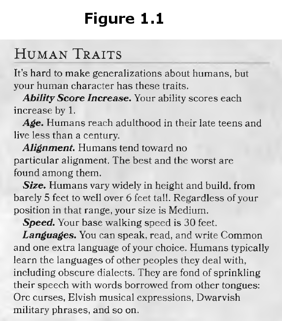
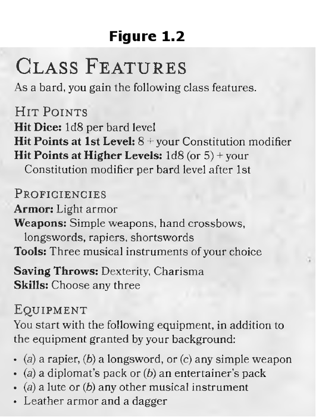

## Step 2: Stat Blocks
The stat block consists of ability scores, modifiers, and skill modifiers (**Figure 2.1**, **Figure 2.2**).
1.  **Ability Scores**: Generate via rolling (4d6, drop lowest) or using standard array (15, 14, 13, 12, 10, 8). Refer to your class's "Quick Build" (**Figure 2.3**) and race's "Ability Score Increase" (**Figure 2.4**).
2.  **Ability Modifiers**: Calculated based on your score (e.g., 14-15 = +2).
3.  **Proficiency Modifier**: All level 1 characters start with +2.
4.  **Saving Throws & Skills**: Check circles for proficiencies granted by class and background. Add your proficiency modifier to the relevant ability modifier for these.
5.  **Passive Perception**: 10 + Perception skill bonus.

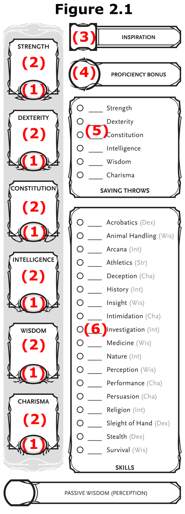
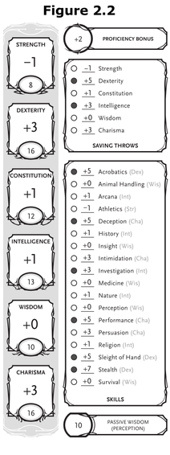
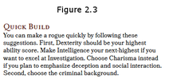
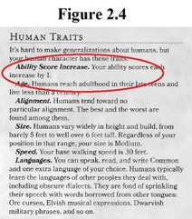

## Step 3: Proficiencies and Languages
List all non-skill proficiencies (armor, weapons, kits) and languages known from your race and background (**Figure 3.1**).

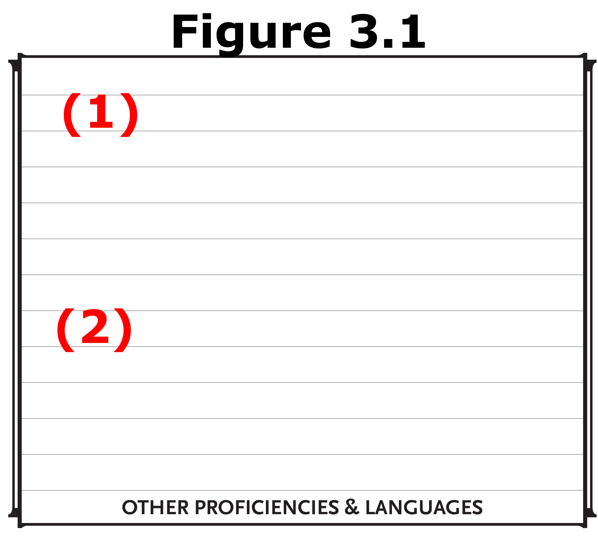

## Step 4: Equipment
Choose between default starting gear or purchasing gear with starting gold. List all items and remaining money (**Figure 4.1**).

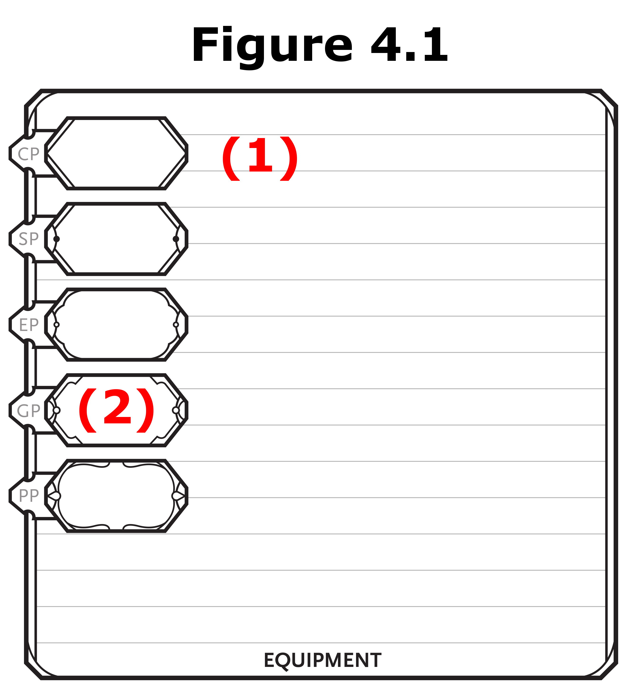

## Step 5: Attacks and Spellcasting
1.  **Physical Weapons**: List weapons and their attack modifiers (Strength/Dexterity + Proficiency if proficient).
2.  **Damage**: Note damage dice and type (e.g., 1d8 Piercing) (**Figure 5.1**).

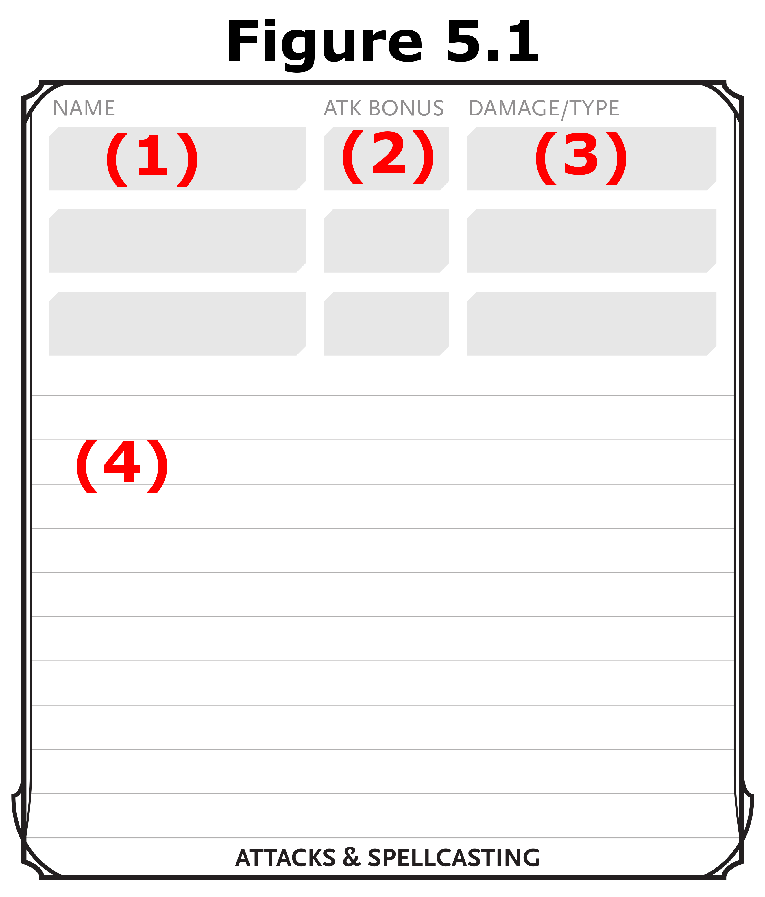

## Step 6: HP and Combat Stats
Calculate Armor Class (AC), Initiative (Dexterity modifier), Speed, and Hit Points (Max value of hit die + Constitution modifier) (**Figure 6.1**).

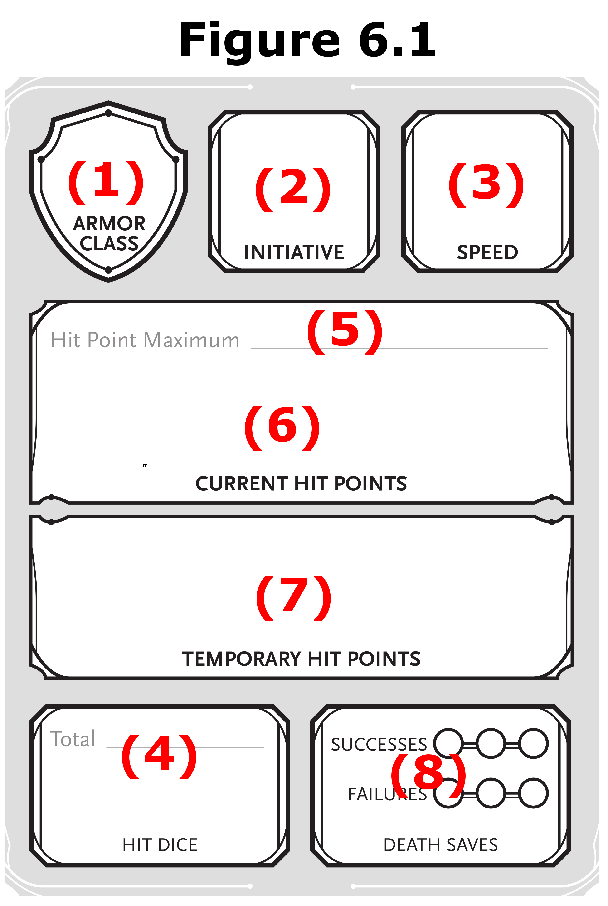

## Step 7: Features
List remaining features from your class, race, and background in the Features block (**Figure 7.1**).

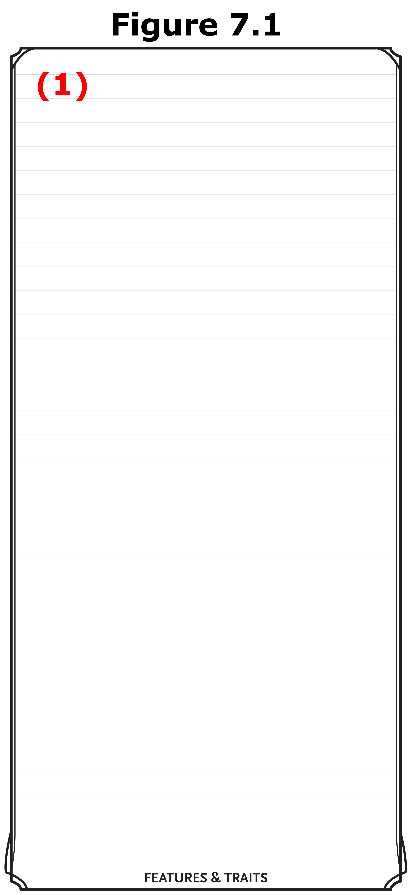

## Step 8: Traits
Define your character's Personality Traits, Ideals, Bonds, and Flaws. You can roll for these in your background section or create your own (**Figure 8.1**).

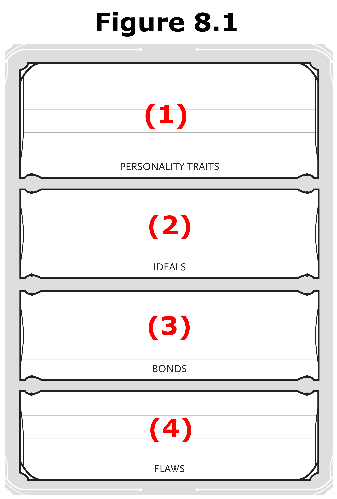

## Step 9: Name and Remaining Information
Fill in the Character Name, Class & Level (typically Level 1), Background, Player Name, Race, Alignment, and start at 0 Experience Points (**Figure 9.1**).

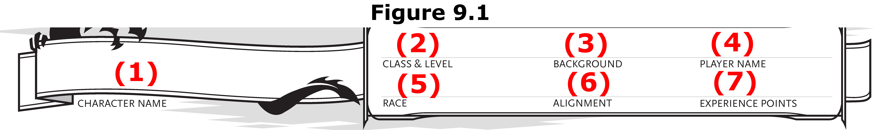

## Step 10: Review
Review your sheet for any missing information by comparing it to the example in **Figure 10.1**.

